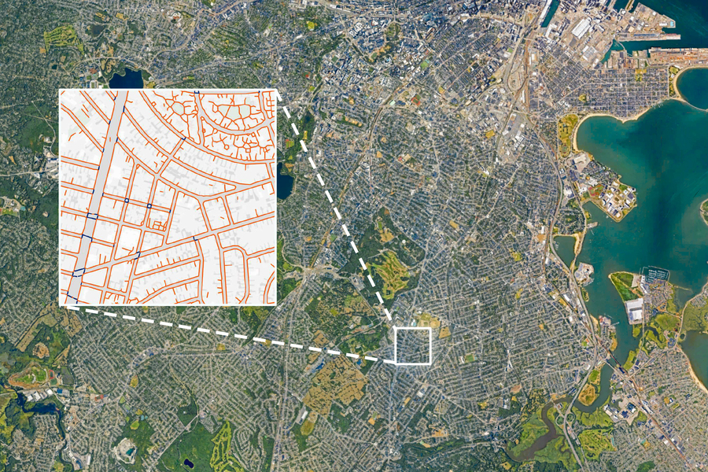

# Tile2Net

<p align="left">

</p>

Tile2Net is an end-to-end tool for automated mapping of pedestrian infrastructure using aerial imagery. We trained a
semantic segmentation model to detect roads, sidewalk, crosswalk, and footpath from orthorectified imagery. The results
are then converted to geo-referenced polygons and finally a topologically interconnected centerline network is
generated. This work is as an important step towards a robust and open-source framework that enables comprehensive
digitization of pedestrian infrastructure, which we argue to be a key missing link to more accurate and reliable
pedestrian modeling and analyses. By offering low-cost solutions to create planimetric dataset describing pedestrian
environment, we enable cities with a tight budget to create datasets describing pedestrian environment which otherwise
would
not be possible at a comparable cost and time.

The model is presented in our [paper](https://www.sciencedirect.com/science/article/pii/S0198971523000133) published at
the *Computers Environment and Urban Systems* journal.

**Mapping the walk: A scalable computer vision approach for generating sidewalk network datasets from aerial imagery**\
Maryam Hosseini, Andres Sevtsuk, Fabio Miranda, Roberto M. Cesar Jr, Claudio T. Silva\
*Computers, Environment and Urban Systems, 101 (2023) 101950*

```
@article{hosseini2023mapping,
  title={Mapping the walk: A scalable computer vision approach for generating sidewalk network datasets from aerial imagery},
  author={Hosseini, Maryam and Sevtsuk, Andres and Miranda, Fabio and Cesar Jr, Roberto M and Silva, Claudio T},
  journal={Computers, Environment and Urban Systems},
  volume={101},
  pages={101950},
  year={2023},
  publisher={Elsevier}
}
```


## Getting Started

1. [What is New?](#what-is-new)
2. [Semantic Segmentation Requirements](#semantic-segmentation-requirements)
3. [Installation](#installation)
4. [Create Your First Project](#create-your-first-project)
5. [Run Our Example](#run-our-example)
6. [Running in the Terminal](#running-in-the-terminal)
7. [Running Interactively](#running-interactively)


## What is New?

This is the Beta Version release of our code, featuring updated API and imprived model compared to our baseline and
published results.  
During this experimental release, we encourage and welcome your feedback to help us improve the tool before publishing
it as a PyPI and Conda package.

If your region of interest is not supported by our tool yet, but the high-resolution orthorectified tiles are publicly
available, you can add the information of your region together with the link to the tiles
under [this](https://github.com/VIDA-NYU/tile2net/issues/2) topic, and we will do our best to include that region to our
catalogue of supported regions.

Compared to our 2022 trained model (published in Feb. 2023), the semantic segmentation model is now trained on more
data, including Manhattan, making it more generalizable.  
Additionally, the network generation algorithm is now more generalized, not fine-tuned and fitted to any specific
datasets, and thus should perform better on cities outside the training domain.  
However, it is important to note that this also means the resulting network of Boston, Cambridge, NYC, and DC may differ
from models specifically fine-tuned and fitted to each city, as described in the paper.

Aside from that, we have updated the code to work with the most recent, stable version of PyTorch (2.0.0) and Shapely (
2.0.0), removing dependencies on apex and PyGeos.

## Semantic Segmentation Requirements

- Hardware: ==1 CUDA-enabled GPU for inference
- Software:  ***CUDA==11.7, Python==3.10.9, pytorch==2.0.0***

## Installation

It is highly recommended to create a virtual environment using either pip or conda to install Tile2Net and its
dependencies. You can clone the repository by running the commands:

```
git clone git@github.com:VIDA-NYU/tile2net.git
cd tile2net
```

Activate your virtual environment and install locally:

```
python -m pip install -e .
```

## Create Your First Project

In general, you will interact with the tool through two main components, `generate` and `inference`, both of which work
with the Raster module.
`generate`, as its name indicates, generates the project structure, downloads the weights and in case your region of
interest is supported by Tile2Net, also prepares the image tiles, and finally outputs a JSON text regarding the raster
specifications and the paths to the various resources. To know more about the basic concepts behind the tool, please
read [this.](https://github.com/VIDA-NYU/tile2net/blob/main/BASICS.md)

`inference` will then run the semantic segmentation model on the prepared tiles (or your own tile data which should be
prepared following the guidelines [here](https://github.com/VIDA-NYU/tile2net/blob/main/DATA_PREPARE.md)), detect roads,
sidewalks, footpaths, and crosswalks in your image data
and outputs the polygons and network data for your region. All output maps are in WGS 84 Web Mercator (espg:4326), to
best integrate with world-wide industry platforms such as Google Maps, Mapbox and Esri.

The weights used by the semantic segmentation model are available on
the [Google Drive](https://drive.google.com/drive/folders/1cu-MATHgekWUYqj9TFr12utl6VB-XKSu).

## Run Our Example

An [example.sh](https://github.com/VIDA-NYU/tile2net/blob/main/examples/example.sh) script is also available, which
will prompt the user for a path where the project should be created and saved. It will then download the tiles
corresponding to Boston Commons and Public Garden, creates larger tiles (stitched together) for inference, run
inference, create the polygon and network of this region. The sample area is small, just so you can test your
environment settings and GPU, and see what to look for.

To run that, open your terminal and run:

```
bash ./examples/example.sh 
```

## Running in the Terminal

To run the model in the terminal, you need to pass three main arguments:  _location_ -l, _name_ -n, and _output_dir_ -o.
There are other default parameters that you can modify, such as zoom level, tile_step, stitch_step, but the first three
are required to create a `Raster` object for your region.

Currently `python tile2net generate` and `python tile2net inference` are supported. The tool also supports
piping results e.g. `python tile2net generate <args> | python tile2net inference` to allow for the whole process to be
run in a single command.

To run the program in the terminal you can use the following command (replace <> with the appropriate information):

```
python tile2net generate -l <coordinate or address> -n <project name> -o <path to output directory>
```

Once that command is run and generate the respective files, use the command below to run inference and get the polygons
and network. You can find the path to your city_info JSON file from the output of generate command above, look for the
path printed in front of `INFO       Dumping to`:

```
python tile2net inference --city_info <path to your region info json>
```

## Running Interactively

Tile2Net may also be run interactively in a Jupyter notebook by importing with `from tile2net import Raster`. To view
the project structure and paths, access the `Raster.project` attribute and subattributes.

The Raster instance can also be created from the city info json file with the method `Raster.from_info()`.

This tool is currently in early development and is not yet ready for production use. The API is subject to change.

To see more, there is an [inference.ipynb](https://github.com/VIDA-NYU/tile2net/blob/main/examples/inference.ipynb)
interactive notebook to demonstrate
how to run the inference process interactively.

