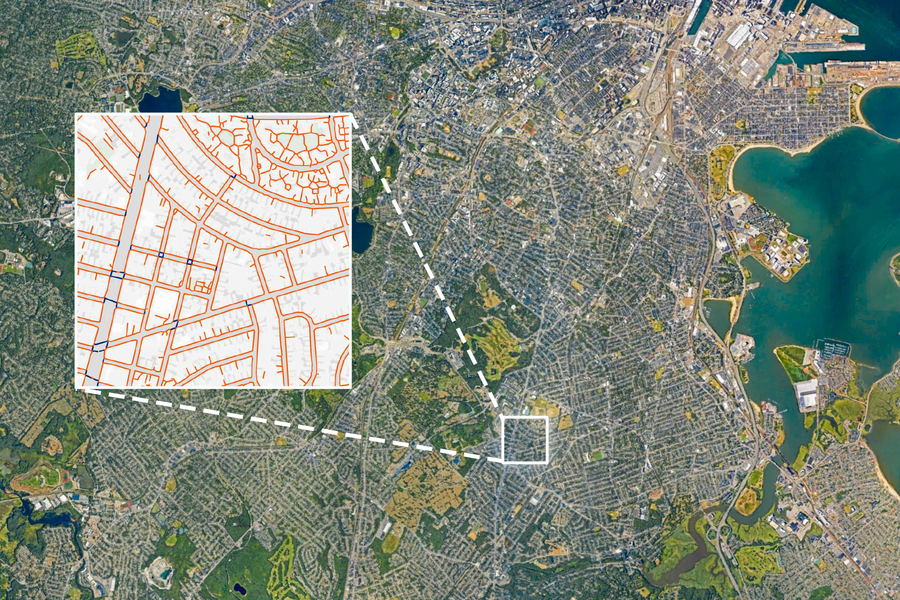
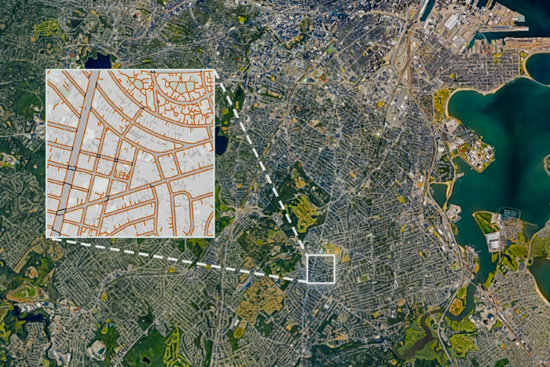

# Tile2Net


<!-- HTML image formatting does not cooperate with Sphinx! -->
<!-- 
<p align="left">

</p> -->




Tile2Net is an end-to-end tool for automated mapping of pedestrian infrastructure from aerial imagery. We trained a
semantic segmentation model to detect roads, sidewalk, crosswalk, and footpath from orthorectified imagery. The results
are then converted to geo-referenced polygons and finally a topologically interconnected centerline network is
generated. This work is as an important step towards a robust and open-source framework that enables comprehensive
digitization of pedestrian infrastructure, which we argue to be a key missing link to more accurate and reliable
pedestrian modeling and analyses. By offering low-cost solutions to create planimetric dataset describing pedestrian
environment, we enable cities with a tight budget to create datasets describing pedestrian environment which otherwise
would
not be possible at a comparable cost and time.

The model is presented in our [paper](https://www.sciencedirect.com/science/article/pii/S0198971523000133) published at
the *Computers Environment and Urban Systems* journal.

**Mapping the walk: A scalable computer vision approach for generating sidewalk network datasets from aerial imagery**\
Maryam Hosseini, Andres Sevtsuk, Fabio Miranda, Roberto M. Cesar Jr, Claudio T. Silva\
*Computers, Environment and Urban Systems, 101 (2023) 101950*

```
@article{hosseini2023mapping,
  title={Mapping the walk: A scalable computer vision approach for generating sidewalk network datasets from aerial imagery},
  author={Hosseini, Maryam and Sevtsuk, Andres and Miranda, Fabio and Cesar Jr, Roberto M and Silva, Claudio T},
  journal={Computers, Environment and Urban Systems},
  volume={101},
  pages={101950},
  year={2023},
  publisher={Elsevier}
}
```

## Updates:
- Tile2Net in Esri's Pedestrian Infrastructure Classification model: [ArcGIS Living Atlas](https://www.arcgis.com/home/item.html?id=c0d520baa30d4b47ab36232231c17875) 
- Tile2Net now supports Alameda County. You can find the list of supported regions [here](https://github.com/VIDA-NYU/tile2net/blob/main/BASICS.md#supported-regions)
- Tile2Net now supports the whole Oregon state. You can find the list of supported regions [here](https://github.com/VIDA-NYU/tile2net/blob/main/BASICS.md#supported-regions).
- Tile2Net was featured in [Planitizen](https://www.planetizen.com/news/2023/03/122206-mapping-sidewalks-improved-connectivity)! 
- Tile2Net was featured in [MIT News Spotlight](https://news.mit.edu/2023/open-source-tool-mapping-sidewalks-0315#:~:text=Now%20MIT%20researchers%2C%20along%20with,want%20to%20expand%20pedestrian%20infrastructure)!

## Getting Started

1. [What is New?](#what-is-new)
2. [Semantic Segmentation Requirements](#semantic-segmentation-requirements)
3. [Installation](#installation)
4. [Create Your First Project](#create-your-first-project)
5. [Run Our Example](#run-our-example)
6. [Running in the Terminal](#running-in-the-terminal)
7. [Running Interactively](#running-interactively)


## What is New?

This is the Beta Version release of our code, featuring updated API and improved model compared to our baseline and
published results.  
During this experimental release, we encourage and welcome your feedback to help us improve the tool before publishing
it as a PyPI and Conda package.

If your region of interest is not supported by our tool yet, but the high-resolution orthorectified tiles are publicly
available, you can add the information of your region together with the link to the tiles
under [this](https://github.com/VIDA-NYU/tile2net/issues/11) topic, and we will do our best to include that region to our
catalogue of supported regions.

Compared to our 2022 trained model (published in Feb. 2023), the semantic segmentation model is now trained on more
data, including Manhattan, making it more generalizable.  
Additionally, the network generation algorithm is now more generalized, not fine-tuned and fitted to any specific
datasets, and thus should perform better on cities outside the training domain.  
However, it is important to note that this also means the resulting network of Boston, Cambridge, NYC, and DC may differ
from models specifically fine-tuned and fitted to each city, as described in the paper.

Aside from that, we have updated the code to work with the most recent, stable version of PyTorch (2.0.0) and Shapely (
2.0.0), removing dependencies on apex and PyGeos.

## Semantic Segmentation Requirements

- Hardware: one CUDA-enabled GPU for inference
- Software: Python 3.11 through 3.14 and a CUDA-compatible PyTorch installation

## Installation

It is highly recommended to create a virtual environment using either pip or conda to install Tile2Net and its
dependencies. You can clone the repository by running the commands:

```
git clone git@github.com:VIDA-NYU/tile2net.git
cd tile2net
```

Activate your virtual environment and install locally:

```
conda create --name testenv python=3.11
conda activate testenv
python -m pip install -e .
```

## Create Your First Project

Tile2Net exposes two commands, `generate` and `inference`, both backed by the
`Raster` module.

`generate` creates the project structure, downloads and verifies the two model
checkpoints, downloads supported imagery or reads user-provided tiles, stitches
the inference inputs, and writes project metadata. The final JSON emitted to
standard output can be piped directly to `inference`. See
[BASICS.md](https://github.com/VIDA-NYU/tile2net/blob/main/BASICS.md) for the
underlying concepts and supported imagery sources.

Model checkpoints are cached outside the installed package at
`~/.cache/tile2net/weights` by default. Set `TILE2NET_WEIGHTS_DIR` to use a
different location, such as a shared read-only model directory on an HPC
system. Downloads are installed only after their byte size and SHA-256 digest
match the pinned manifest.

`inference` runs the semantic segmentation model on the prepared tiles, or on
user imagery prepared according to
[DATA_PREPARE.md](https://github.com/VIDA-NYU/tile2net/blob/main/DATA_PREPARE.md).
It extracts roads, sidewalks, footpaths, and crosswalks, then creates polygon
and pedestrian-network outputs. Vector outputs default to GeoParquet;
Shapefile is available explicitly with `--vector-format shapefile`.

Final vector outputs use WGS 84 geographic coordinates (EPSG:4326), expressed
as longitude and latitude degrees. EPSG:4326 is not Web Mercator; Web Mercator
is EPSG:3857.

Segmentation PNGs and side-by-side previews are optional. Use
`--dump_percent 0` to save none, `--dump_percent 100` to save all, or an
intermediate percentage for a deterministic sample. This option does not
affect polygon or network generation.

The published model artifacts are identified by the versioned Figshare DOIs
`10.6084/m9.figshare.33315570.v1` and
`10.6084/m9.figshare.33315558.v1`.

## Run Our Example

The [example.sh](https://github.com/VIDA-NYU/tile2net/blob/main/examples/example.sh)
script prompts for an output directory and runs the complete Boston Common and
Public Garden example. It downloads and verifies the model checkpoints,
downloads the imagery, stitches the inference tiles, runs CUDA inference, and
creates segmentation previews, polygons, and a pedestrian network. The area is
deliberately small so that the command can validate the environment and GPU.

To run that, open your terminal and run:

```bash
bash ./examples/example.sh
```

## Running in the Terminal

`generate` requires `--location` and `--name`. `--output` is optional but is
recommended so that the project location is explicit. Other options include
the zoom level, tile step, stitch step, boundary dataset, and imagery source.

Run generation with:

```bash
uv run python -m tile2net generate \
  --location "<coordinate bounding box or address>" \
  --name "<project-name>" \
  --output "<output-directory>"
```

The command writes the city-information JSON path after `INFO Dumping to`. Run
local CUDA inference from that metadata with:

```bash
uv run python -m tile2net inference \
  --city_info "<path-to-project-info.json>" \
  --local \
  --eval test \
  --dump_percent 0
```

The complete pipeline can be connected with a shell pipe; `--city_info` is not
needed because `inference` reads the JSON emitted by `generate`:

```bash
set -o pipefail

uv run python -m tile2net generate \
  --location "<coordinate bounding box or address>" \
  --name "<project-name>" \
  --output "<output-directory>" \
  | uv run python -m tile2net inference \
      --local \
      --eval test \
      --dump_percent 0
```

## Running Interactively

Tile2Net may also be run interactively in a Jupyter notebook by importing with `from tile2net import Raster`. To view
the project structure and paths, access the `Raster.project` attribute and subattributes.

The Raster instance can also be created from the city info json file with the method `Raster.from_info()`.

This tool is currently in early development and is not yet ready for production use. The API is subject to change.

To see more, there is an [inference.ipynb](https://github.com/VIDA-NYU/tile2net/blob/main/examples/inference.ipynb)
interactive notebook to demonstrate
how to run the inference process interactively.
